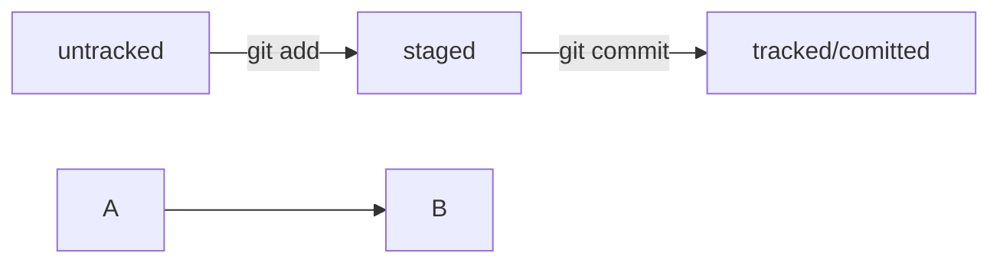

- [VCS](#vcs)
- [Работа с консолью](#работа-с-консолью)
- [Навигация](#навигация)
- [Работа с файлами и папками](#работа-с-файлами-и-папками)
    - [Создание](#создание)
    - [Копирование и перемещение](#копирование-и-перемещение)
    - [Чтение](#чтение)
    - [Удаление](#удаление)
- [Полезные возможности](#полезные-возможности)
- [Шпаргалка. Начало работы с Git](#Шпаргалка-Начало-работы-с-Git)
- [Работа с GIT-ом](#работа-с-GIT-ом)
    - [Чем отличается запоминание от сохранения?](#чем-отличается-запоминание-от-сохранения)
    - [Игнорирование файлов](#Игнорирование-файлов)
    - [Генерация пары SSH ключей](#генерация-пары-SSH-ключей)
    - [Markdown](#Markdown)
    - [Mermaid](#Mermaid)
- [Статусы файлов в Git](#Статусы-файлов-в-Git)
- [ХЭШ](#ХЭШ)
- [Сравнение двух файлов в Visual Studio Code](#Сравнение-Двух-Файлов-в-Visual-Studio-Code)
- [Работа с ветками](#Работа-с-ветками)
- [Порядок создания проекта на GitHub](#порядок-создания-проекта-на-GitHub)
- [Жизненный цикл одного пул-реквеста](#жизненный-цикл-одного-пул-реквеста)
- [Шпаргалка. Командная работа в Git](#Шпаргалка-Командная-работа-в-Git)

https://practicum.yandex.ru/profile/git-basics/  
https://github.com/Kapablas/git-info

## VCS
Система контроля версий, или VCS, — это программное обеспечение, которое помогает отслеживать изменения в программах, текстовых файлах, больших документах, веб-сайтах и так далее.

- Система контроля версий, или VCS (SCM), — программа, позволяющая контролировать изменения в проекте.
- Git — один из примеров системы контроля версий: он позволяет хранить, изменять и анализировать историю проекта.
- Git — незаменимый в команде инструмент, ведь он помогает объединять результаты работы нескольких человек.
- Чтобы Git начал отслеживать изменения в проекте, папку с файлами этого проекта нужно сделать Git-репозиторием (от англ. repository — «хранилище»)!

Установка: https://practicum.yandex.ru/trainer/git-basics/lesson/2a82ddb7-19cf-437e-a187-f976804fddad/

## Работа с консолью:
- символ доллара ($) — он означает, что программа ждёт ваших команд.
- pwd (от англ. print working directory) — «показать рабочую папку». Узнать, где вы сейчас.
- ls – список файлов и папок в директории
- ls -a - вывели список, в котором отображаются скрытые файлы ., .. и .git. –a это –all
- ls -l (от англ. long). Команда ls -l будет выводить подробную информацию о содержимом текущего каталога.
- ls ~ - выведет содержимое домашней директории вне зависимости от того, что показывает pwd.
- ls .. - покажет содержимое родительской директории.
- cd ~ - вернуться в домашнюю директорию. С помощью терминала вы всегда можете перейти к домашней директории. Для этого нужно ввести команду cd (от англ. change directory — «сменить директорию») и символ ~ — обозначение домашней директории. 
- cd (от англ. change directory — «сменить директорию»). Допустим, вы находитесь в директории /projects. Если ввести команду cd github, она перенесёт вас в директорию /projects/github. если в названии папки есть пробелы, при вводе нужно использовать кавычки: $ cd "Фотографии с дня рождения"
- .. - чтобы вернуться в родительскую директорию — то есть на уровень выше, — вместо названия папки нужно написать две точки
- . – с точки начинаются названия скрытых файлов
- touch (англ. «коснуться») – чтобы создать файл, нужно ввести в консоль команду touch с именем файла в качестве параметра: touch %ИМЯ_ФАЙЛА% - $ touch my-new-file.
- mkdir (от англ. make directory — «создать директорию»). Можно создать целую структуру директорий одной командой с помощью флага –p: mkdir -p dir1/dir-inside/dir-deeper-inside # создали папку dir-deeper-inside в папке dir-inside, которая находится в папке dir1
- cp - (от англ. copy — «копировать»). Копирование файлов. $ cp что_копируем что_копируем что_копируем куда_копируем: $ cp index.html style.css script.js src/ - скопировали три файла (index.html, style.css и script.js) в папку src
- mv - перемещение файлов и папок. После имени команды указывают список файлов и папок, которые нужно переместить, а затем — папку, в которую нужно выполнить перемещение. $ mv table.csv ./very-important-files (./ - текущая директория)
- cat (от англ. concatenate and print — «объединить и распечатать») - прочитать файл. Команда распечатает то, что содержится в нём. Команда cat работает только с текстовыми файлами. Вывести этой командой файл другого типа (например, изображение) не получится.
- rm (от англ. remove — «удалить») - удалить файл. 
- rmdir (от англ. remove directory — «удалить директорию») - команда удалит папку. Если в папке, которую вы пытаетесь стереть, есть какие-то файлы, то командная строка не удалит её и выведет сообщение о том, что папка не пуста (англ. Directory not empty).
- rm -r (-r — от англ. recursive, «рекурсивный») рекурсивно удаляет файлы и папки. Это значит, что удаление будет последовательно применяться к каждому из элементов в этой папке — пока не сотрёт их все. Затем команда удалит пустую директорию.
- && - Команды в терминале необязательно вбивать и выполнять по очереди. Их можно указывать не по одной, а сразу списком. Для этого их нужно разделить двумя амперсандами (&&). $ mkdir second-project && cd second-project && touch index.html style.css - создаём папку second-project, переходим в папку second-project и создаём в ней два файла: index.html и style.css
- Tab - автоматически дописывает не только команды, но и пути. Начните печатать имя папки или файла (они должны быть в той же директории) и нажмите Tab. Терминал заполнит имя автоматически. Есть ещё один способ использовать Tab при навигации в другую директорию. Если ввести cd с названием папки, а затем нажать Tab, в консоль в качестве подсказки выведутся все возможные пути.
- cd /c + Enter - Чтобы попасть в корневую директорию Windows, нужно перейти на соответствующий диск.

## Навигация
- pwd (от англ. print working directory, «показать рабочую папку») — покажи, в какой я папке;
- ls (от англ. list directory contents, «отобразить содержимое директории») — покажи файлы и папки в текущей папке;
- ls -a — покажи также скрытые файлы и папки, названия которых начинаются с символа .;
- cd first-project (от англ. change directory, «сменить директорию») — перейди в папку first-project;
- ls -l (от англ. long). Команда ls -l будет выводить подробную информацию о содержимом текущего каталога.
- cd first-project/html — перейди в папку html, которая находится в папке first-project;
- cd .. — перейди на уровень выше, в родительскую папку;
- cd ~ — перейди в домашнюю директорию (/Users/Username);
- cd / — перейди в корневую директорию.
## Работа с файлами и папками
### Создание
- touch index.html (англ. touch, «коснуться») — создай файл index.html в текущей папке;
- touch index.html style.css script.js — если нужно создать сразу несколько файлов, можно напечатать их имена в одну строку через пробел;
- mkdir second-project (от англ. make directory, «создать директорию») — создай папку с именем second-project в текущей папке.
### Копирование и перемещение
- cp file.txt ~/my-dir (от англ. copy, «копировать») — скопируй файл в другое место;
- mv file.txt ~/my-dir (от англ. move, «переместить») — перемести файл или папку в другое место.
### Чтение
- cat file.txt (от англ. concatenate and print, «объединить и распечатать») — распечатай содержимое текстового файла file.txt.
### Удаление
- rm about.html (от англ. remove, «удалить») — удали файл about.html;
- rmdir images (от англ. remove directory, «удалить директорию») — удали папку images;
- rm -r second-project (от англ. remove, «удалить» + recursive, «рекурсивный») — удали папку second-project и всё, что она содержит.

## Полезные возможности
- Команды необязательно печатать и выполнять по очереди. Можно указать их списком — разделить двумя амперсандами (&&).
- У консоли есть собственная память — буфер с несколькими последними командами. По ним можно перемещаться с помощью клавиш со стрелками вверх (↑) и вниз (↓).
- Чтобы не вводить название файла или папки полностью, можно набрать первые символы имени и дважды нажать Tab. Если файл или папка есть в текущей директории, командная строка допишет путь сама.
Например, вы находитесь в папке dev. Начните вводить cd first и дважды нажмите Tab. Если папка first-project есть внутри dev, командная строка автоматически подставит её имя. Останется только нажать Enter.

## Шпаргалка. Начало работы с Git

### Инициализация репозитория
- git init (от англ. initialize, «инициализировать») — инициализируй репозиторий.
### Синхронизация локального и удалённого репозиториев
- git remote add origin https://github.com/YandexPracticum/first-project.git (от англ. remote, «удалённый» + add, «добавить») — привяжи локальный репозиторий к удалённому с URL https://github.com/YandexPracticum/first-project.git
- git remote rm origin - отвязать от локального репозитория удаленный origin
- git remote -v (от англ. verbose, «подробный») — проверь, что репозитории действительно связались;
- git push -u origin main (от англ. push, «толкать») — в первый раз загрузи все коммиты из локального репозитория в удалённый с названием origin.
- 💡 Ваша ветка может называться master, а не main. Подправьте команду, если это необходимо.
- git push (от англ. push, «толкать») — загрузи коммиты в удалённый репозиторий после того, как он был привязан с помощью флага -u.
### Подготовка файла к коммиту
- git add todo.txt (от англ. add, «добавить») — подготовь файл todo.txt к коммиту;
- git add --all (от англ. add, «добавить» + all, «всё») — подготовь к коммиту сразу все файлы, в которых были изменения, и все новые файлы;
- git add . — подготовь к коммиту текущую папку и все файлы в ней.
### Создание и публикация коммита
- git commit -m "Комментарий к коммиту." (от англ. commit, «совершать», фиксировать» + message, «сообщение») — сделай коммит и оставь комментарий, чтобы было проще понять, какие изменения сделаны;
- git push (от англ. push, «толкать») — добавь изменения в удалённый репозиторий.
### Просмотр информации о коммитах
- git log (от англ. log, «журнал [записей]») — выведи подробную историю коммитов;
- git log --oneline (от англ. log, «журнал [записей]» + oneline, «одной строкой») — покажи краткую информацию о коммитах: сокращённый хеш и сообщение.
### Просмотр состояния файлов
- git status (от англ. status, «статус», «состояние») — покажи текущее состояние репозитория.
### Добавление изменений в последний коммит
- git commit --amend --no-edit (от англ. amend, «исправить») — добавь изменения к последнему коммиту и оставь сообщение прежним;
- git commit --amend -m "Новое сообщение" — измени сообщение к последнему коммиту на Новое сообщение.
- 💡 Выйти из редактора Vim: нажать Esc, ввести :qa!, нажать Enter.
### «Откат» файлов и коммитов
- git restore --staged hello.txt (от англ. restore, «восстановить») — переведи файл hello.txt из состояния staged обратно в untracked или modified;
- git restore hello.txt — верни файл hello.txt к последней версии, которая была сохранена через git commit или git add;
- git reset --hard b576d89 (от англ. reset, «сброс», «обнуление» + hard, «суровый») — удали все незакоммиченные изменения из staging и «рабочей зоны» вплоть до указанного коммита.
### Просмотр изменений
- git diff (от англ. difference, «отличие», «разница») — покажи изменения в «рабочей зоне», то есть в modified-файлах;
- git diff a9928ab 11bada1 — выведи разницу между двумя коммитами;
- git diff --staged — покажи изменения, которые добавлены в staged-файлах.

## Работа с GIT-ом
Первым делом необходимо представиться. Чтобы участникам проекта было понятно, кто и какие изменения вносил, нужно представиться и указать имя пользователя и адрес электронной почты.
- git config (от англ. configuration — «конфигурация», «настройка») с ключом --global (англ. «глобальный»). В качестве значения user.name нужно указать своё имя или никнейм. Для настройки параметра user.email указывают электронную почту.
$ git config --global user.name "User Namovich" - имя или ник нужно написать латиницей и в кавычках
$ git config --global user.email username@yandex.ru - здесь нужно указать свой настоящий email
- $ cat ~/.gitconfig или $ git config --list - Все глобальные настройки Git хранит в файле .gitconfig в домашней директории. Команда запишет в этот файл указанные имя и почту. Чтобы убедиться в этом, можно вызвать команду для чтения файлов.
- git init - Сделать папку репозиторием. Например, создайте папку first-project и сделайте её Git-репозиторием: перейдите в неё с помощью команды cd и выполните git init.
- rm -rf .git - Если вы случайно сделали Git-репозиторием не ту папку, её можно «разгитить». Для этого нужно удалить скрытую подпапку .git. 
ключ -r (от англ. recursive — «рекурсивно») позволяет удалять папки вместе с их содержимым;
ключ -f (от англ. force — «заставить») избавит вас от вопросов вроде «Вы точно хотите удалить этот файл? А этот? И этот тоже?»
- git status - (от англ. status — «статус», «состояние») — она показывает текущее состояние репозитория.
- git add --all (от англ. add — «добавить» + от англ. all — «всё»). Ключ, или флаг, --all позволяет подготовить к сохранению все файлы в репозитории.
- git add todo.txt - Добавлять файлы можно и по одному, без ключа --all.
- git add . - Также можно добавить текущую папку целиком — в этом случае все файлы в ней тоже будут добавлены. Обратиться к текущей папке в Bash позволяет точка (.).
- git commit -m ‘Мой первый коммит!’ - Сделать коммит можно командой git commit c ключом -m (от англ. message — «сообщение»), который присваивает коммиту сообщение.
- git commit --amend --no-edit common.css - С опцией --amend команда commit не создаст новый коммит, а дополнит последний, просто добавив в него файл common.css
- git commit --amend -m "Добавить главную страницу и стили" - изменить комментарий последнего коммита
- git reset --hard <commit hash> - откатить все изменения к указанному коммиту
- git restore --staged example.txt - убрать файл example.txt из add (staging area) и вернуть его в состояние modified или untracked.
- git restore <file> - Для файлов в статусе "modified" (а-ля ctrl-Z). Изменения в файле «откатятся» до последней версии, которая была сохранена через git commit или git add
- git log - Просмотреть историю коммитов
- git log --oneline - посмотреть историю коммитов в которой только одни коммиты. Чтобы выйти из истории и продолжить работу с терминалом, нужно нажать q
- git diff - Команда git diff сравнит последнюю закоммиченную версию файла с той, что находится в состоянии modified.
- git diff --staged - Команда git diff --staged покажет изменения в staged-файлах (git add) относительно последних закоммиченных версий. Visual Studio Code: Вы можете открыть представление Git, выбрав "View" > "Source Control" в верхнем меню или просто нажав Ctrl + Shift + G.
- git diff a9928ab 11bada1 - покажет различия коммитов с хешами a9928ab и 11bada1.  
Строка @@ -1,2 +1,2 @@ сообщает, какие строки файла попали в сравнение. Выражение 1,2 (неважно, с плюсом или с минусом) говорит, что были использованы две строки, начиная с первой. Если бы было, например, написано +15,7, это значило бы, что в сравнении участвуют 7 строк, начиная с 15-й.
- git push - Отправить изменения на удалённый репозиторий. В первый раз эту команду нужно вызвать с флагом -u и параметрами origin (имя удалённого репозитория) и main или master (название текущей ветки). Флаг -u свяжет локальную ветку с одноимённой удалённой. Как вы связывали локальный и удалённый репозитории в предыдущем уроке, так же и здесь нужно дополнительно связать ветки - $ git push -u origin master.
- README.md — текстовый файл, который можно создать командой touch, а затем редактировать так же, как и любой другой текстовый документ. Например, в блокноте.
- хеш - информация о коммите. Это набор данных: когда был сделан коммит, содержимое файлов в репозитории на момент коммита и ссылка на предыдущий, или родительский (англ. parent), коммит. Все хеши и таблицу хеш → информация о коммите Git сохраняет в служебные файлы. Они находятся в скрытой папке .git в репозитории проекта.

### Чем отличается запоминание от сохранения?
Команда git add не сохраняет содержимое файлов в репозитории. Само сохранение, или фиксацию состояния файлов, называют коммитом (от англ. commit — «совершать», «фиксировать»). «Сделать коммит» значит сохранить текущую версию файла. 
Если провести аналогию, команду git add можно сравнить с добавлением товаров в корзину в интернет-магазине, а коммит — с оформлением и оплатой заказа.

### Игнорирование файлов
- Если нужно, чтобы Git игнорировал какие-то файлы, стоит составить файл .gitignore.
- Посмотреть, что игнорируется, можно с помощью команды git status --ignored.
- Сам файл .gitignore — это обычный файл в репозитории. Его тоже стоит закоммитить.
- Шаблонов много, но их легко найти в интернете вместе с примерами использования: https://practicum.yandex.ru/trainer/git-basics/lesson/92ba6ab8-c151-45ad-a0be-ffa4de31c537/

### Генерация пары SSH ключей
https://practicum.yandex.ru/trainer/git-basics/lesson/42435683-0922-4231-bfb4-d7d32d61f50a/

### Markdown 
это специальный язык разметки. Он позволяет красиво отформатировать текстовый документ README.md.
https://skillbox.ru/media/code/yazyk-razmetki-markdown-shpargalka-po-sintaksisu-s-primerami/
https://gist.github.com/fomvasss/8dd8cd7f88c67a4e3727f9d39224a84c

### Вставка картинки в README

- {username} — ваш ник на ГитХабе;
- {repository} — репозиторий где хранятся картинки;
- {branch} — ветка репозитория;
- {path} — путь к месту нахождения картинки.

### Mermaid
Блок-схемы — распространенный графический способ представления информации. Часто используется для визуализации работы алгоритмов. Блок-схемы обычно состоят из узлов в виде геометрических фигур и стрелок, соединяющих узлы. Mermaid позволяет создавать динамические блок-схемы. 
 
https://habr.com/ru/articles/652867/
 

## Статусы файлов в Git
- git status - команда для проверки статусов файлов
- untracked (англ. «неотслеживаемый») - статусом untracked помечается файл, о существовании которого Git знает, но не следит за изменениями в нём. Этот статус — противоположность tracked, в который попадают все файлы, отслеживаемые Git.
- staged - файл переходит в статус staged после выполнения git add. Когда совсем новый файл попадает в staging area (от англ. stage — «сцена», «этап» и area — «область»), перед его названием указывается new file
- tracked — это противоположность untracked. Оно довольно широкое по смыслу: в него попадают файлы, которые уже были зафиксированы с помощью git commit, а также файлы, которые были добавлены в staging area командой git add. То есть все файлы, в которых Git так или иначе отслеживает изменения.
- modified - статус modified означает, что файл был изменён.

https://practicum.yandex.ru/trainer/git-basics/lesson/860e0bf4-ebd6-4e13-87fa-f76d92cfd11f/

## ХЭШ
- Хеширование (от англ. hash, «рубить», «крошить», «мешанина») — это способ преобразовать набор данных и получить их «отпечаток» (англ. fingerprint).
- Git преобразует информацию о коммитах с помощью алгоритма SHA-1 и для каждого из них рассчитывает уникальный идентификатор — хеш.
- Хеш — основной идентификатор коммита и позволяет узнать его автора, дату и содержимое закоммиченных файлов.
- Все хеши, а также таблицу соответствий хеш → информация о коммите Git хранит в папке .git.
- При работе с Git хеши будут встречаться вам регулярно. Их можно будет передавать в качестве параметра разным Git-командам, чтобы указать, с каким коммитом нужно произвести то или иное действие.
- git log - команда для вызова списка коммитов и их ХЭШей
- При вызове команды git log можно заметить надпись (HEAD -> master) после хеша одного из коммитов. Она указывает на коммит, который сделан последним (то есть на самый новый). Файл HEAD (англ. «голова», «головной») — один из служебных файлов папки .git. Внутри HEAD — ссылка на служебный файл: refs/heads/master. Если заглянуть в этот файл, можно увидеть хеш последнего коммита.

## Сравнение двух файлов в Visual Studio Code
- Откройте оба файла, которые вы хотите сравнить, в редакторе.
- В разделе "EXPLORER" (или в любом другом отображении файлов, к которому вы имеете доступ), щелкните правой кнопкой мыши на одном из файлов, которые вы хотите сравнить, и выберите "Select for Compare" ("Выбрать для сравнения").
Затем щелкните правой кнопкой мыши на втором файле, который вы хотите сравнить, и выберите "Compare with Selected" ("Сравнить с выбранным").
- VSCode откроет новую вкладку, где вы сможете увидеть различия между двумя файлами. Измененные строки будут выделены, а вдоль правой стороны окна будет отображаться миникарта изменений.

## Работа с ветками
- Ветка (англ. branch) — это изолированный поток разработки проекта. В таком потоке можно проверять разные идеи, тестировать новую функциональность и так далее.
### Создание веток
- git branch feature/the-finest-branch (от англ. branch, «ветка») — создай ветку от текущей с названием feature/the-finest-branch; Название ветки в Git может состоять из букв, цифр, а также включать любой из четырёх символов: ., -, _, /. Эти символы не несут особого смысла. Например, ветка feature/add-branch-info могла бы называться feature_add-branch-info или feature-add-branch. Обратите внимание, что ветки не образуют иерархии, как директории, разделённые символом /. Указатели feature (англ. «особенность», «деталь») нужны для веток, где прорабатывается новая функциональность, и bugfix (от англ. bug — «жук», «ошибка» и fix — «исправить») для веток, где ведётся работа по исправлению ошибок. После ключевого слова идёт слеш и описание проблемы или задачи (например, /add-branch-info). Это описание не должно содержать пробелов — следует использовать нижнее подчёркивание или дефис.
- git checkout -b feature/the-finest-branch — создай ветку feature/the-finest-branch и сразу переключись на неё.
### Навигация по веткам
- git branch (от англ. branch, «ветка») — покажи, какие есть ветки в репозитории и в какой из них я нахожусь (текущая ветка будет отмечена символом *);
- git branch -a — покажи все известные ветки, как локальные (в локальном репозитории), так и удалённые (в origin, или на GitHub).
- git checkout feature/br — переключись на ветку feature/br.
### Сравнение веток
- git diff main HEAD (от англ. difference, «отличие», «разница») — покажи разницу между веткой main и указателем на HEAD;
- git diff HEAD~2 HEAD — покажи разницу между тем коммитом, который был два коммита назад, и текущим.
### Удаление веток
- git branch -d br-name — удали ветку br-name, но только если она является частью main;
- git branch -D br-name — удали ветку br-name, даже если она не объединена с main. Удаление локальной ветки через Git не удаляет ветку на GitHub!
### Слияние веток
- git merge main (от англ. merge, «сливать», «поглощать») — объедини ветку main с текущей активной веткой. 
### Работа с удалённым репозиторием
- git push -u origin my-branch (от англ. push, «толкнуть», «протолкнуть») — отправь новую ветку my-branch в удалённый репозиторий и свяжи локальную ветку с удалённой, чтобы при дополнительных коммитах можно было писать просто git push без -u;
- git push my-branch — отправь дополнительные изменения в ветку my-branch, которая уже существует в удалённом репозитории;
- git push --force - отправь дополнительные изменения в ветку. Запушить изменения силой, что уничтожит коммиты, вызывающие конфликт.
- git pull (от англ. pull, «вытянуть») — подтяни изменения текущей ветки из удалённого репозитория.

## Порядок создания проекта на GitHub
1) Создать папку в любом месте на компьютере привычным способом или с помощью консоли ($ mkdir dir1) и перейти в нее
2) Сделать папку репозиторием (хранилищем) ($ git init) и проверить его состояние ($ git status)
3) Поместить в репозиторий файлы проекта и файл описания README.md
4) Представиться и указать имя пользователя и адрес электронной почты.
$ git config --global user.name "User Namovich"
$ git config --global user.email username@yandex.ru
5) Проверить, что имя и почта сохранились правильно ($ git config --list)
6) Создать удалённый репозиторий на GitHub, чтобы в будущем связать его с локальным. Название удалённого репозитория необязательно должно совпадать с именем папки проекта у вас на компьютере. Но чтобы не путаться, будем называть их одинаково.
7) Создать и привязать SSH-ключ к GitHub
8) Привязать удалённый репозиторий к локальному ($ git remote add origin git@github.com:%ИМЯ_АККАУНТА%/first-project.git) origin – переменная, которая содержит путь репозитория. Переменная используется, чтобы не вводить путь каждый раз заново при использовании в командах. Например: git pull origin master - в текущую локальную ветку залить из удаленного репозитория ветку master
9) Убедиться, что репозитории связаны (git remote -v)
10) Отметить файлы за изменением которых необходимо следить (поместить товары в корзину, подготовить файлы к коммиту) Все - $ git add –-all или по одному $ git add file.txt
11) Выполнить коммит ($ git commit -m ‘Мой первый коммит!’)
12)	Отправить изменения на удалённый репозиторий. Если это происходит первый раз, то команда - $ git push -u origin master. Флаг -u свяжет локальную ветку с одноимённой удалённой. Последующие раз команда - $ git push
13)	Зайти в репозиторий на GitHub и убедиться, что в репозитории появились файлы с изменениями.

## Порядок начала работы с чужим репозиторием
1) Открыть чужой репозиторий. Нажать на зелёную кнопку Code. Появится окно со ссылкой. Если уже настроили SSH-ключ, убедиться что выбрана опция SSH и скопировать ссылку
2) Открыть консоль, перейти в папку, в которую нужно положить репозиторий, и выполнить команду git clone. В качестве параметра команде нужно передать адрес репозитория, который был только что скопировали на GitHub - $ git clone https://github.com/yandex-praktikum/git-clone-lesson. Если в GitHub-репозитории что-то поменяется (например, добавятся коммиты), не нужно будет заново клонировать его. Достаточно будет выполнить команду, которая обновит созданную копию.
2.1) Если чужой репозиторий нужно скопировать в свой ГИТ-аккаунт, то нужно перейти в чужой проект и нажать на кнопку FORK - Create fork (англ. **«создать копию репозитория»). Обычно комбинация «форк» + clone используется для внесения изменений в публичные репозитории. В этом случае «форк» становится подготовительным этапом перед клонированием чужого репозитория на ваш компьютер.
3) git clone автоматически связывает локальный репозиторий с удалённым. Убедиться в том, что репозитории связаны, командой git remote -v.  
$ git remote -v  
origin    git@github.com:yandex-praktikum/git-clone-lesson.git (fetch)  
origin    git@github.com:yandex-praktikum/git-clone-lesson.git (push)  
4) git pull - скачать все ветки и файлы с удаленного репозитория в локальный
- Сначала нужно перейти в локальный репозиторий и убедиться, что вы находитесь в правильной ветке, — как правило, это основная ветка
- Затем можно ввести команду $ git pull. git pull — это первая команда, которую вводит разработчик, как только открывает код проекта, чтобы начать с ним работать.
- Дополнительно git pull и git merge выполняют перед тем, как создать пул-реквест. При командной работе, особенно в больших командах, основная ветка часто успевает «убежать» вперёд, пока вы подготавливаете свои изменения. Поэтому перед созданием пул-реквеста рекомендуется сначала подтянуть изменения из основной ветки, объединить их с вашей, решить все возможные конфликты и лишь затем сделать push:  

$ git checkout main # перешли в main 
$ git pull # подтянули новые изменения в main 
$ git checkout my-branch # вернулись в рабочую ветку my-branch 
$ git merge main # влили main в новую ветку my-branch 
$ git push -u origin my-branch # отправили ветку my-branch в удалённый репозиторий 

5) git push -u origin main  - Отправить локальную ветку в удалённый репозиторий. Находясь в основной ветке выполнить команду git push с флагом -u, который свяжет локальную ветку с удалённой. Также команде нужно передать параметры origin и имя текущей ветки. Теперь основная ветка появится на GitHub. Оrigin - переменная, содержащая имя удалённого репозитория -  git@github.com:%ИМЯ_АККАУНТА%/first-project.git.
6) pull request (англ. «запрос на изменения»; буквально: «запрос на подтягивание»)
- Пул-реквест — это запрос на рассмотрение предлагаемых изменений и часть процесса ревью.
- Запрос на изменения можно инициировать двумя способами: через ссылку, которую Git выводит после создания ветки, или через интерфейс GitHub.
- После создания пул-реквеста ваши коллеги сделают ревью — оценят предложенные вами правки и оставят свои комментарии.
- По результатам ревью ваши правки могут быть приняты в основную ветку проекта или возвращены на доработку.

## Жизненный цикл одного пул-реквеста
1) Автор создаёт пул-реквест.
2) Ревьюер просматривает изменения и предлагает правки, если они необходимы.
3) Автор вносит исправления по комментариям ревьюера.
4) Второй и третий пункты могут повториться!
5) Если ревьюера всё устраивает, он одобряет («апрувит») пул-реквест.
6) Вуаля! Теперь автор или ревьюер могут влить изменения в основную ветку.

## Что делать, если основная ветка «убежала» вперёд в процессе ревью
1) Хотя GitHub предоставляет интерфейс для разрешения конфликтов, обычно это делается локально. 
2) Перейти в ветку main.
3) Загрузить новые изменения из неё с помощью git pull. При этом вы также загрузите ветку вашего коллеги.
4) Снова перейти в вашу ветку feature/my-new-awesome-code.
5) Выполнить git merge main и разрешить конфликт локально. В результате будет создан локальный коммит слияния.

## Шпаргалка. Командная работа в Git
### Feature branch workflow
- Самый популярный подход к работе с Git в команде — это feature branch workflow. В нём создают ветку для каждой задачи (например, для новой функциональности или исправления бага), а когда всё готово, вливают новую ветку в main.
- Важные этапы этого процесса — пул-реквест и ревью изменений. Пул-реквест — это интерфейс, в котором можно обсудить изменения. Ревью — просмотр изменений другими участниками и один из способов проверить качество таких изменений.
- Если вы уже участник проекта (или collaborator в терминах GitHub), можно клонировать репозиторий напрямую. А если нет, нужно предварительно сделать «форк». Также для участников доступна кнопка Merge после ревью, а для неучастников — нет.

### Алгоритм-шпаргалка для создания PR (пул-реквест)
1) Склонировать репозиторий.
- Если вы не участник проекта, предварительно сделать «форк» исходного репозитория.
- На странице репозитория или «форка» нажать кнопки: Code → SSH → скопировать ссылку.
- Выполнить команду git clone <ссылка на репозиторий>.
2) Создать ветку для вашей задачи: git checkout -b my-task-branch-name.
3) Добавить и «закоммитить» изменения, которые вы хотите внести в проект.
4) «Запушить» ветку: git push --set-upstream origin HEAD или git push -u origin my-task-branch-name.
- GitHub (с помощью Git) выведет ссылку на создание PR. По ней нужно перейти.
- PR можно также создать через интерфейс GitHub.
5) Сообщить о пул-реквесте ревьюеру.
- Иногда ревьюеры назначаются автоматически, тогда сообщать не нужно.
6) Обсуждать с ревьюером предлагаемые изменения и вносить правки, пока эти изменения не будут одобрены (пока не будет получен «апрув»).  
7) Если кто-то добавил конфликтующие изменения в main, пока ваш PR был на ревью, нужно разрешить конфликт:  
- Обновить main: git checkout main && git pull.
- Влить main в свою ветку: git checkout my-task-branch-name && git merge main.
- Разрешить конфликты слияния с помощью IDE или вручную.
- Создать коммит слияния: git commit --no-edit или git commit -m 'merge main'.
- Сделать git push своей ветки.
8) Нажать кнопку Merge или подождать, пока её нажмёт кто-то ещё.
9) Ещё раз обновить main, чтобы «подтянуть» ваши изменения в основную ветку локального репозитория: git checkout main && git pull.
10) Вы великолепны! Можете начинать снова со второго пункта.

### Алгоритм-шпаргалка для разрешения конфликтов слияния
1) Открыть проект в IDE (VS Code, IDEA или другие).
2) Открыть файл, в котором есть конфликт.
3) Выбрать, какие части файла нужно взять из одной ветки, а какие — из другой.
4) Когда конфликты разрешены, сделать коммит: git commit --no-edit или git commit -m 'merge branch <название ветки>'.